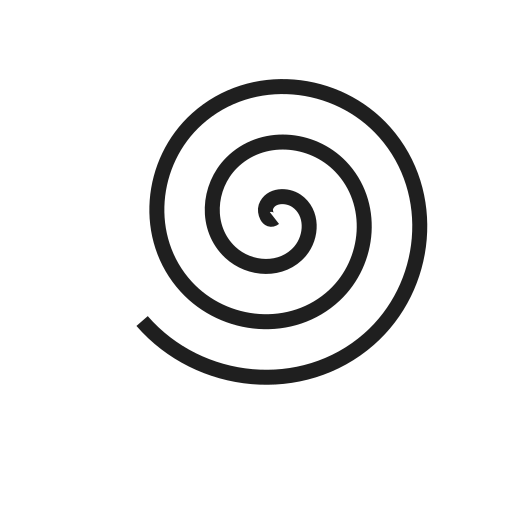
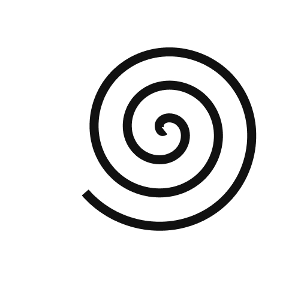

This guide explains how to add optimized, lazy-loaded [SVG images](https://developer.mozilla.org/en-US/docs/Web/SVG) to content pages using [standard Markdown image syntax](https://daringfireball.net/projects/markdown/syntax#img).


[Thulite SVG](/svg/) is a Thulite integration that provides a shortcode for inlining SVG icons and graphics directly into your HTML, making them easy to style and manipulate with CSS.


## Example

### Page resource

```md

```


#### Rendered HTML

```html

```

## Caveat

An SVG with a grey stroke and a transparent background will have low contrast in dark mode, though it looks fine in light mode — toggle between light and dark mode to see the effect in the example above.

### Solution 1: Set an SVG background color

Add to `assets/scss/common/_variables-custom.scss`:

```scss {title="_variables-custom.scss"}
// Put your custom (S)CSS variables here
:root {
  --markdown-svg: #fff; // SVG background color
}
```

#### Result

Result (visually) — toggle between light and dark mode to see the effect:



### Solution 2: Invert SVG colors in dark mode

Add to `assets/scss/common/_custom.scss`:

```scss {title="_custom.scss"}
@include color-mode(dark) {
  .markdown-svg {
    filter: invert(100%); // invert colors in dark mode
    // filter: invert(1) brightness(0.78); // invert colors and reduce brightness in dark mode
  }
}
```

#### Result

Result (visually) — toggle between light and dark mode to see the effect:


{.svg-inline-custom .svg-darkmode}


{.svg-inline-custom .svg-lightmode}
